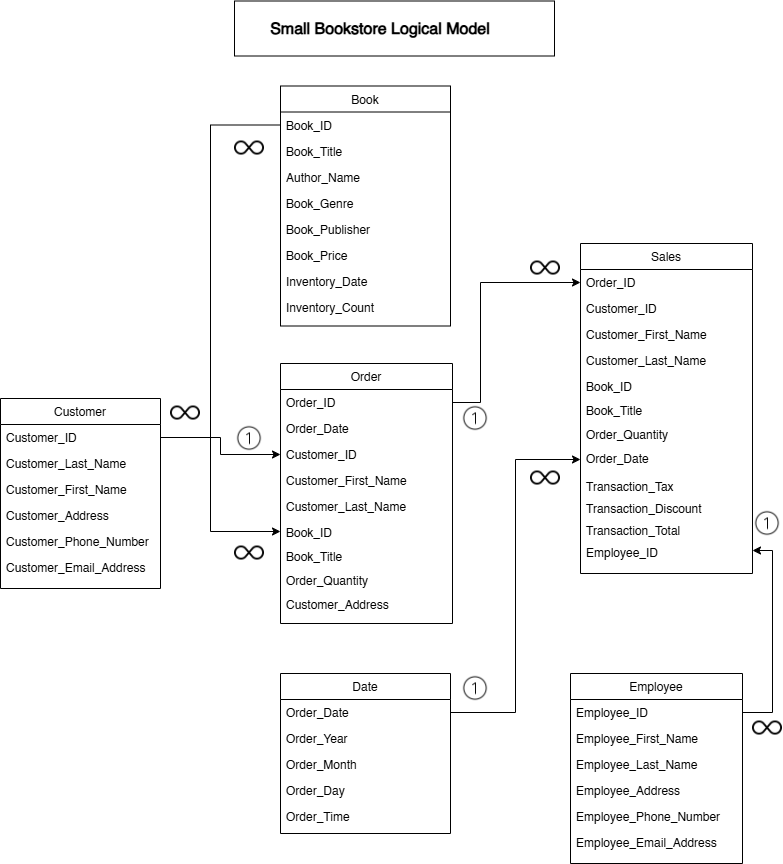
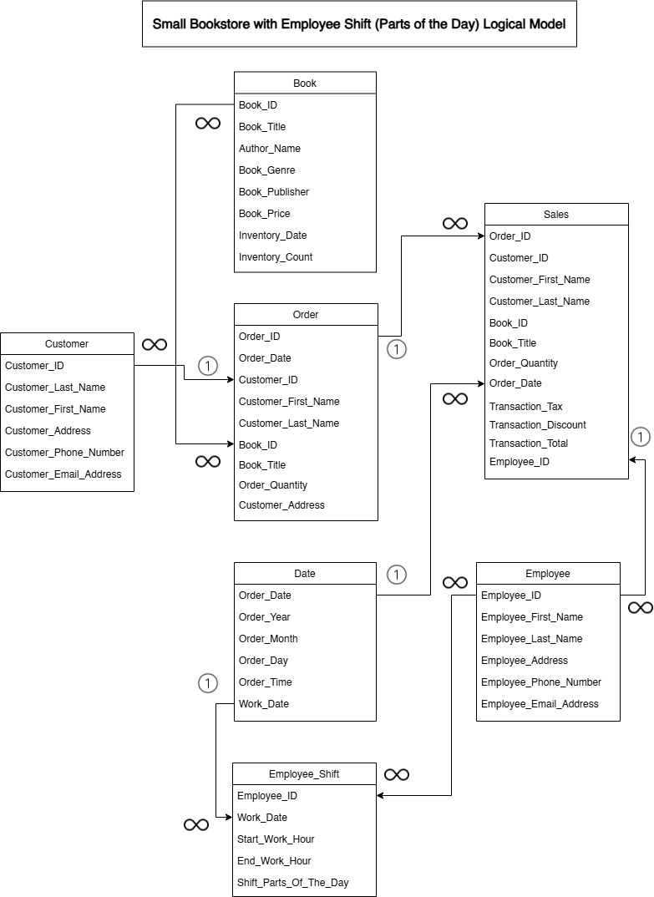

# Assignment 1: Design a Logical Model

## Question 1
Create a logical model for a small bookstore. 📚

At the minimum it should have employee, order, sales, customer, and book entities (tables). Determine sensible column and table design based on what you know about these concepts. Keep it simple, but work out sensible relationships to keep tables reasonably sized. Include a date table. There are several tools online you can use, I'd recommend [_Draw.io_](https://www.drawio.com/) or [_LucidChart_](https://www.lucidchart.com/pages/).

-

## Question 2
We want to create employee shifts, splitting up the day into morning and evening. Add this to the ERD.

-

## Question 3
The store wants to keep customer addresses. Propose two architectures for the CUSTOMER_ADDRESS table, one that will retain changes, and another that will overwrite. Which is type 1, which is type 2?

_Hint, search type 1 vs type 2 slowly changing dimensions._

Bonus: Are there privacy implications to this, why or why not?

For an architecture where the customer_address table overwrites changes, the customer's address is updated whenever a change is made. There won't be a way to keep track of changes over time. This is known as the Type 1 Slowly Changing Dimension. The changes to customer addresses are overwritten and only the most recent address remains.  This also simplifies data storage by keeping only the current information. This can be used when historical accuracy isn’t important. For example, if a store wants to ship a package to a customer, they only need the customer's current address to know where they'll send the package.

In a Type 2 slowly changing dimensions, a new record will always be created. The historical records are preserved by adding a new row for each change in the customer's address. This allows tracking address history changes but results in larger table sizes as records accumulate. This method is useful for maintaining an accurate history of address changes but it may introduce privacy concerns since it retains potentially sensitive addresses in the system. One way to mitigate this is by implementing retention policies that comply with privacy laws which might require deleting customer addresses after a certain period.

## Question 4
Review the AdventureWorks Schema [here](https://i.stack.imgur.com/LMu4W.gif)

Highlight at least two differences between it and your ERD. Would you change anything in yours?

The AdventureWorks schema is very detailed and useful for a large organization like theirs. The ERD I made is just for a small book store who have a small number of staff, less complex processes, and just sells one type of product - books.

One difference that I see on their schema and my ERD is they have a more complicated sales process. They have several stores, sales people for B2B and B2C, process transactions in different currencies. In my small bookstore, we only have one branch, no dedicated sales people, and just sell to retail customers.

Another difference is with their Product table have a lot more columns which have data for different references keys (i.e. product number, ProductSubcategoryID, ProductModelID) that are used for different tables and processes. This emphasizes that they have lots of products and have to manage a lot of information. It looks like they also have a website to which their list the product descriptions, add photos and illustrations, and manage reviews. The ERD that I made is only for a small brick and mortar bookstore that only sells one type of product - books. 

After looking at the schema of AdventureWorks, tt would probably a good idea to add an HR department on my ERD too so that there would be tables for employee's salary, hiring staff, and employment history. I can add there the employee and shifts tables that I currently have.

# Criteria

[Assignment Rubric](./assignment_rubric.md)

# Submission Information

🚨 **Please review our [Assignment Submission Guide](https://github.com/UofT-DSI/onboarding/blob/main/onboarding_documents/submissions.md)** 🚨 for detailed instructions on how to format, branch, and submit your work. Following these guidelines is crucial for your submissions to be evaluated correctly.

### Submission Parameters:
* Submission Due Date: `September 28, 2024`
* The branch name for your repo should be: `model-design`
* What to submit for this assignment:
    * This markdown (design_a_logical_model.md) should be populated.
    * Two Entity-Relationship Diagrams (preferably in a pdf, jpeg, png format).
* What the pull request link should look like for this assignment: `https://github.com/<your_github_username>/sql/pull/<pr_id>`
    * Open a private window in your browser. Copy and paste the link to your pull request into the address bar. Make sure you can see your pull request properly. This helps the technical facilitator and learning support staff review your submission easily.

Checklist:
- [ ] Create a branch called `model-design`.
- [ ] Ensure that the repository is public.
- [ ] Review [the PR description guidelines](https://github.com/UofT-DSI/onboarding/blob/main/onboarding_documents/submissions.md#guidelines-for-pull-request-descriptions) and adhere to them.
- [ ] Verify that the link is accessible in a private browser window.

If you encounter any difficulties or have questions, please don't hesitate to reach out to our team via our Slack at `#cohort-4-help`. Our Technical Facilitators and Learning Support staff are here to help you navigate any challenges.
